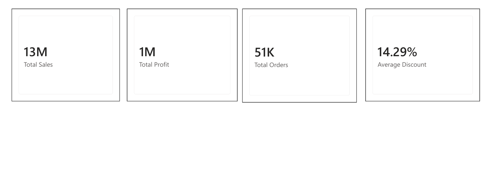
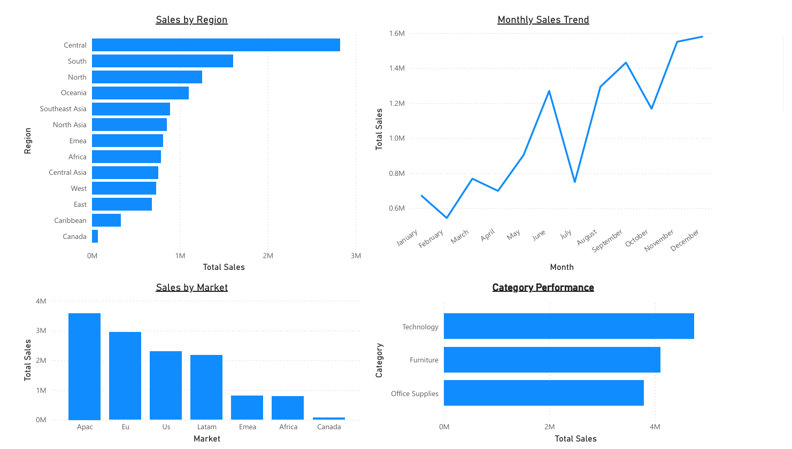
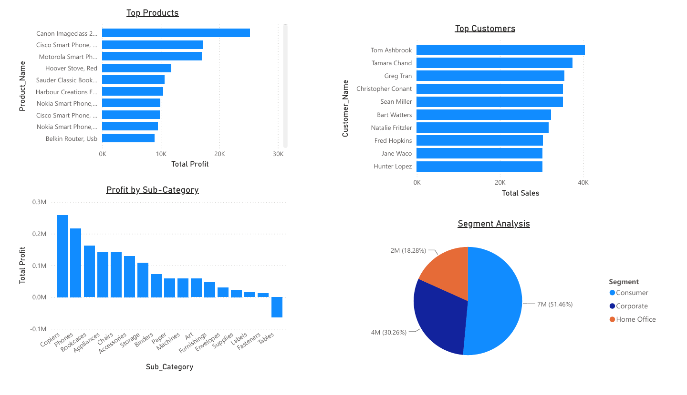

# Online Retail Sales Analysis

## Project Overview

This project analyzes online retail transaction data to understand sales performance, customer behavior, product trends, and business growth opportunities.

The objective is to clean the retail dataset, perform analysis using Excel, SQL and create an interactive Power BI dashboard to generate business insights.

---

## Tools Used

- Excel (Data Cleaning, Pivot Tables, Analysis)
- SQL (Data Analysis Queries)
- Power BI (Interactive Dashboard)

---

## Dataset

The dataset contains online retail transactions including:

- Order_Id	
- Order_Date	
- Ship Date	
- Ship_Mode	
- Customer_Name	
- Segment	
- State	
- Country	
- Market	
- Region	
- Product_Id	
- Category	
- Sub_Category	
- Product_Name	
- Sales	
- Quantity	
- Discount	
- Profit	
- Shipping_Cost	
- Order_Priority	
- Year		

---

## Data Cleaning

Performed data preparation steps:

- Removed duplicate records
- Handled missing values
- Checked invalid numerical values
- Removed cancelled transactions where required
- Standardized text values
- Created calculated columns for analysis

---

## Excel Analysis

Performed:

- Total Sales calculation
- Total Profit analysis
- Average Discount analysis
- Top-selling products analysis
- Loss-making product analysis
- Region-wise sales analysis
- Profit by Category
- Segment-wise Sales analysis
- Monthly Sales Trend

---

## SQL Analysis

Created SQL queries to analyze:

- Top 10 profitable products
- Top customers by sales
- Region-wise sales analysis
- Category performance analysis
- Discount analysis
- Loss-making transactions
- Monthly sales trends
- Market-wise revenue analysis
- Shipping mode analysis
- Product profitability analysis

---

## Power BI Dashboard

Created an interactive sales dashboard with:

### Page 1: Retail Sales Performance Dashboard

Includes key business KPIs:

- Total Sales
- Total Profit
- Total Orders
- Average Discount

### Page 2: Sales Analysis

Analyzes sales performance:

- Sales by Region
- Sales by Market
- Monthly Sales Trend
- Category Performance

### Page 3: Product & Customer Insights

Focuses on:

- Top Products
- Top Customers
- Profit by Sub-Category
- Segment Analysis

## Key Insights

- Identified highest revenue-generating regions
- Analyzed profitable and loss-making products
- Found customer segments contributing most sales
- Evaluated sales trends over time

## Dashboard Preview

